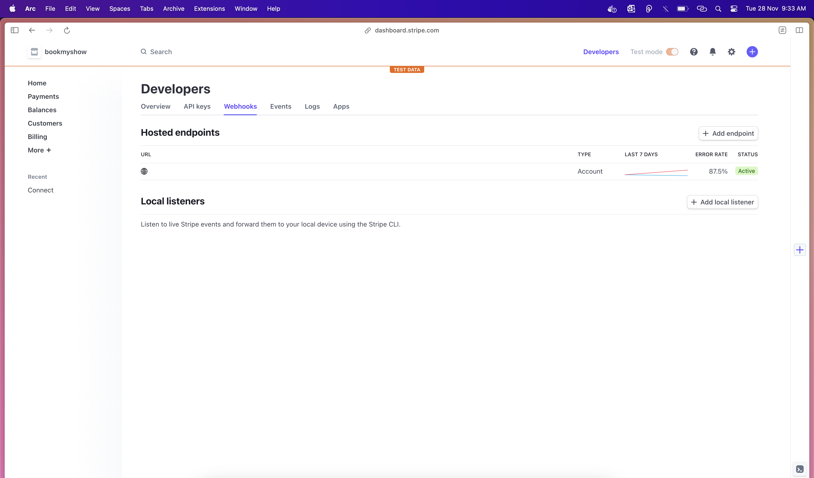
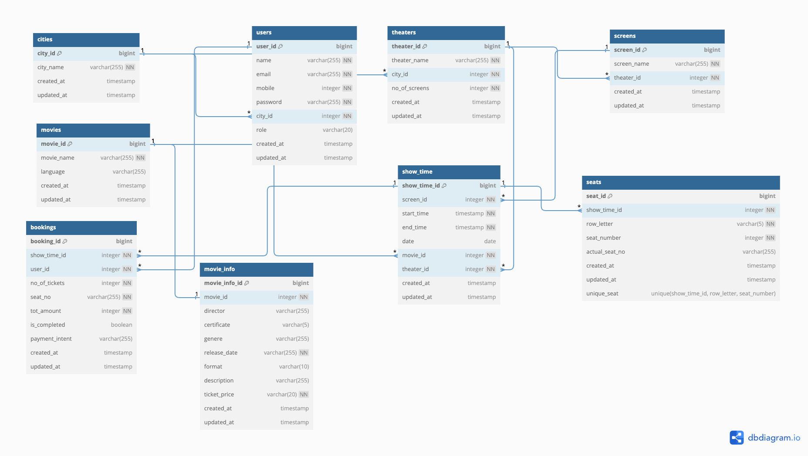

# Bookmyshow Case Study

This Node.js Fastify application functions as a RESTful API for the bookmyshow case study, intergrated mysql database for persistent storage of data with schema level validation done using inbuilt fastify plugin's. The API offers a range of features, including user management (creation and authentication) with role's available as admin and customer. As an admin user, he has access for creation of resources such as movies, seats, theaters, city etc; For the customer(user) they can search for a particular movie via a theater or find theater via a movie get their info and proceed to booking and confirmation of ticket.

## Table of Contents

- [Features](#features)
- [Prerequisites](#prerequisites)
- [Installation](#installation)
- [Usage](#usage)
- [Data Modelling](#datamodel)
- [Validation](#validation)
- [Endpoints](#endpoints)

## Features

- User Management: Users can create accounts and authenticate securely.
- Role-Based Access Control (RBAC): Admin users are granted exclusive access to run scheduled tasks(clean up activity of seats) maintian application data.
- Admin Intercation: Admin user's can maintain the application data has full access (CRUD) operations.
- User Interactions: Users can search for a particular movie via a theater or find theater via a movie and get their info and proceed to booking.
- Caching: Data fetched from APIs are cached using Redis for optimized performance.
- Payment: Using stripe for payment gateway and included webhooks for further operations in our db when payment completes
- Simple UI only for stripe payment integration is avaialble via static url http://localhost:3000/public/index.html

## Prerequisites

Before you begin, ensure you have met the following requirements:

- Node.js and npm installed.
- Node version 18 or above

## Installation

1. Clone this repository

```bash
git clone https://github.com/vazanth/bookmyshow-case-study.git
```

2. Install dependencies

```bash
npm install
```

3. .env.example is sample, so create a new .env file and provide required information such as DB, Port information

4. Run Server

```bash
npm run dev
```

5. For Stripe setup create an account in stripe and create a publisher and secret key. Secret key belongs with server and publisher key with client

6. For webhook setup we need a real url, it wont work with localhost, so either use their cli for local testing or setup ngork and configure that url in webhook, screenshot below



# Data Model



Check the sql folder for db queries related to table creation, constraints and procedures

# Usage

You can browse the apis at <http://localhost:3000> using either in postman or curl or any api platform

# Validation

This project uses the inbuilt validator of fastify and also since typescript is used type's were declared all the major components in the application.

# Endpoints

| Endpoint                                     | Description                                     | Payload                           |
| -------------------------------------------- | ----------------------------------------------- | --------------------------------- |
| `POST /api/users/sign-up`                    | Register a new user.                            | [sign-up](#sign-up)               |
| `POST /api/users/sign-in`                    | log in a new user.                              | [sign-in](#sign-in)               |
| `POST api/theaters/movies/search?title=star` | Get movies for a theater based on title search. | [theater_search](#theater_search) |
| `POST api/movies/theaters/search?title=the`  | Get theaters for movies based on title search.  | [movie_search](#movie_search)     |
| `POST api/movies/100/info`                   | Get Movie Information                           |                                   |
| `POST api/booking`                           | Initiate Booking for a show                     | [init_bookig](#init_booking)      |
| `POST api/booking/create-payment-intent`     | Creates a intent from front end screen          | [intent](#intent)                 |
| `POST api/booking/webhook`                   | setup webhook in stripe for events              | payload will be passed by stripe  |
| `POST api/cities`                            | Add a new city.                                 | [add_city](#add_city)             |
| `DELETE api/cities/113`                      | Delete a city by ID.                            |                                   |
| `GET api/cities?limit=3&offset=5`            | Fetch cities with pagination.                   |                                   |
| `PATCH api/cities/114`                       | Update a city by ID.                            | [upd_city](#upd_city)             |
| `POST api/movies`                            | Add a new movie.                                | [add_movie](#add_movie)           |
| `DELETE api/movies/112`                      | Delete a movie by ID.                           |                                   |
| `GET api/seats/114`                          | Fetch seats for a particular show               |                                   |
| `POST api/seats`                             | create seats for a particular show              | [add_seats](#add_seats)           |
| `POST api/seats/remove-expired-seats/start`  | remove seats after show expires                 | [remove_shows](#remove_shows)     |
| `GET api/movies`                             | Fetch all movies.                               |                                   |
| `PATCH api/movies/112`                       | Update a movie by ID.                           | [upd_movie](#upd_movie)           |
| `POST api/theaters`                          | Add a new theater.                              | [add_theater](#add_theater)       |
| `DELETE api/theaters/113`                    | Delete a theater by ID.                         |                                   |
| `GET api/theaters?city_id=100`               | Fetch theaters by city ID.                      |                                   |
| `PATCH api/theaters/113`                     | Update a theater by ID.                         | [upd_theater](#upd_theater)       |

## Payload Sample

# sign-up

```json
{
  "name": "newtest",
  "email": "new2@gmail.com",
  "mobile": 8523690147,
  "password": "Test12@4",
  "city_id": 107,
  "role": "customer"
}
```

# sign-in

```json
{
  "email": "admin@gmail.com",
  "password": "Test12@4"
}
```

# theater_search

```json
{ "from_date": "2023-11-10", "to_date": "2023-12-20" }
```

# movie_search

```json
{ "from_date": "2023-11-10", "to_date": "2023-12-20" }
```

# add-city

```json
{ "city_name": "New Mexico" }
```

# upd_city

```json
{ "city_name": "New York" }
```

# add_movie

```json
{ "movie_name": "The Empire Strikes Back", "language": "English" }
```

# upd_movie

```json
{ "movie_name": "Revenge of the Sith", "language": "English" }
```

# add_seats

```json
{ "show_time_id": 117, "seat_number": 1, "row_letter": "D" }
```

# remove_shows

```json
{"hourly": 23}
```

# add_theate

```json
{ "theater_name": "The Empire Strikes Back", "city_id": 0, "no_of_screens": 6 }
```

# upd_theater

```json
{ "city_id": 0, "theater_name": "Star Cinemazz", "no_of_screens": 3 }
```

# init_booking

```json
{ "show_time_id": 101, "seat_no": "A001,A002", "no_of_tickets": 3 }
```

# intent

```json
{ "payment_method_types": ["card"], "booking_id": 1, "amount": 1000, "currency": "inr" }
```
